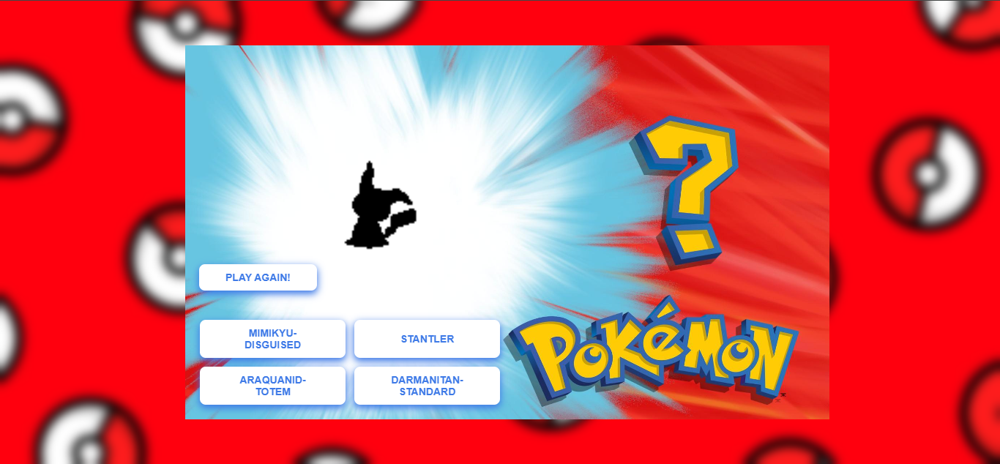
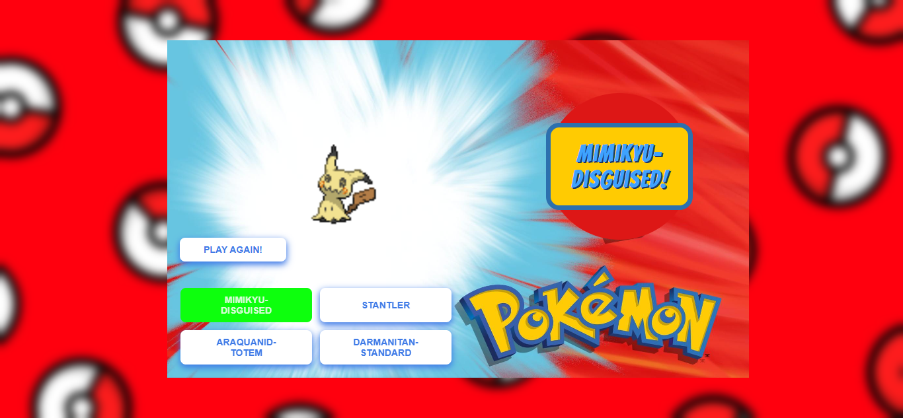

# Who's That Pokemon?
Pokemon's famous trivia question "Who's that pokemon?" turned into a game.

Play It Here: [https://pari55051.github.io/whos-that-pokemon/](https://pari5501.github.io/whos-that-pokemon/)

## Features
- fetch pokemons randomly from the PokeAPI
- have a silhoutte till one of the options is selected
- display the correct/incorrect visually
- display + say the correct answer as part of feedback

## Learning
- learnt how to make a quiz app
- learnt use of API
- finding apis

## Credits
- made by: [unowen](https://github.com/pari55051)
- API: [PokeAPI](https://pokeapi.co/)
- font: [Bangers - google fonts](https://fonts.google.com/specimen/Bangers)
